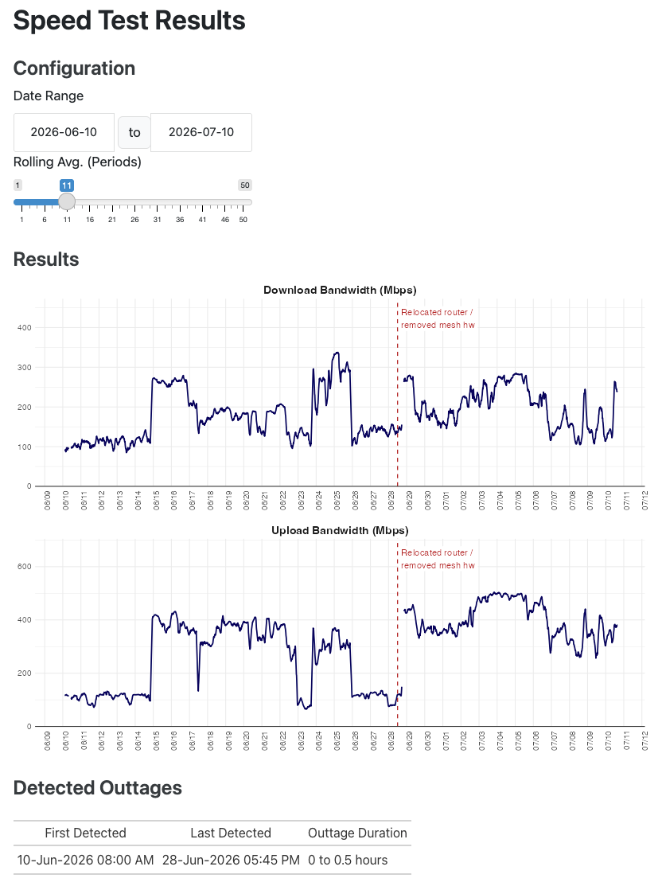

# speedtest-local

A simple script to use the Ookla Speed Test command line interface to do local internet speed tests on a recurring basis and log the results to a local file.

This includes a data collection script and then a couple of options for viewing the results.

Nothing about this is particularly robust, as it was a quick and hacky little side project.

## Data Collection

`run-speedtest.r` is an R script that runs the speed test. It rights the results of the test to `speedtest_log.csv`. The location of this file is hardcoded in the script. There are some other instructions for getting the Speedtest CLI set up in the comments in that script.

Once the script is configured and working, it can be scheduled using the `cronR` package on the Mac or using Task Scheduler on Windows. The schedule can be set up for any frequency.

If there are specific "events" you want to record and see in the results as intervention markers, create a `key_events_log.csv` that has a structure like the following:

```
"date","event"
2026-05-19,"Switched to fiber internet (altafiber)"
2026-06-28,"Relocated router / removed mesh hw"
```

## Viewing Results

There are two options for viewing results (aside from just downloading `speedtest_log.csv` and using any analytics platform for that:

- `results-speedtest.qmd` - this is a static view of the data, but it includes all of the metrics (some of which I don't entirely know what they mean).

- `results-speedtest-interactive.qmd` - this is a Quarto doc that includes Shiny so the date range can be adjusted, and the results can be smoothed by turning them into a rolling average. This will also show any events in the `key_events_log.csv` file that fall in the selected date range. And, it will display "detected outtages" which is a bit of a misnomer, as it just means time blocks where data wasn't collected when it tried to run the speedtest.


